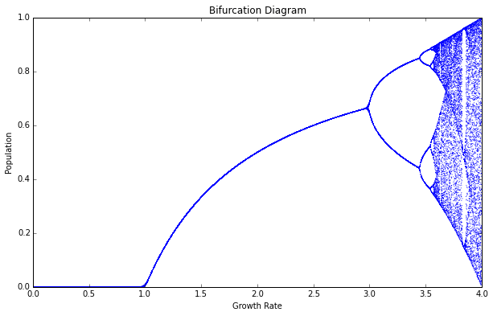

# LogisticEncryptor

## A cryptography program based on the logistic equation.

I wrote this program totally inspired on Baptista's article "Cryptography with Chaos", in which the author suggests a cryptographic method using the logistic equation. It is very interesting, since it takes full advantage of its chaotic behavior (sensitivity on initial conditions) for security implementations.

However, it isn't a completely independent cryptographic method, as it relies on sending, alongside the encrypted message, the initial conditions (keys) used in the process, which would require some other (independent) form of cryptography. Still, an interesting read, and proposal, regardless.

## The method
We start with a discrete-time logistic equation, as above:
$$x_{n+1} = b \, x_n \, (1 - x_n)$$

The algorithm will take advantage of its chaotic attractors, which can be seen on its bifurcation diagram, as above:

## Sources 
* BAPTISTA, M. S. [Cryptography with chaos](https://citeseerx.ist.psu.edu/viewdoc/download?doi=10.1.1.476.9974&rep=rep1&type=pdf). Physics letters A, v. 240, n. 1-2, p. 50-54, 1998.
