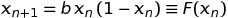
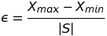
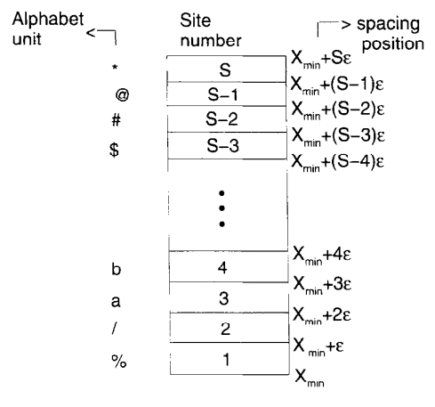

# LogisticEncryptor

## A cryptography method based on the logistic equation

I wrote this program totally inspired on Baptista's article "Cryptography with Chaos", in which the author suggests a cryptographic method using the logistic equation. It is very interesting, since it takes full advantage of this equation's chaotic behavior (sensitivity on initial conditions) for security implementations.

However, it isn't a completely independent cryptographic method, as it relies on sending, alongside the encrypted message, the initial conditions (keys) used for the encryption, which would require some other (independent) form of cryptography. Still, an interesting read, and proposal, regardless.

## The logistic equation
We start with a discrete-time logistic equation, as below:

The algorithm will take advantage of its chaotic attractors, which can be seen on its bifurcation diagram, as above:

Blue dots represent fixed points of the equation, which appear after many consecutive iterations of _F_ applied on some initial condition _Xo_. When we have a finite number _N_ of points vertically above some _x_-axis value, we say we have a stable periodic orbit (of period _N_). Between 1 and 3, we have period 1; between 3 and 3.5, we have period 2, then period 4, etc, until chaos ensues at around 3.6 (we call it a period-doubling cascade/bifurcation).

In particular, we will take some specific values of _b_ (_x_-axis) such that we have a continuous vertical line; that is to say, it corresponds to _b_'s chaotic attractor. I assume it's preferable to use values greater than ~3.7 (and less than 4), since its chaotic attractor won't be disconnected, but maybe it doesn't really make a difference; it just needs to be a chaotic attractor. 

## The encryption

To write the message, we need some prior choice of letters (our alphabet _S_, of size _|S|_). Given a chaotic attractor _(Xmin, Xmax)_, we partition it in _|S|_ equal *subintervals* of size

each of which will correspond to its respective letter of the alphabet. A representation from Baptista's article is shown below.

So to encrypt some message *M*, we need to have the following information (which are also called the "keys" of the encryption process):
* An alphabet _S_;
* a logistic (chaotic) parameter _b_ (i.e. its chaotic attractor);
* some initial condition _Xo_.

To take full advantage of _b_'s chaotic behavior, we can also assume that 
* some transient time _No_ 

is also a key; that is, we iterate the logistic equation, starting from _Xo_, for _No_ timesteps, and then we start the encryption.

## Sources 
* BAPTISTA, M. S. [Cryptography with chaos](https://citeseerx.ist.psu.edu/viewdoc/download?doi=10.1.1.476.9974&rep=rep1&type=pdf). Physics letters A, v. 240, n. 1-2, p. 50-54, 1998.
